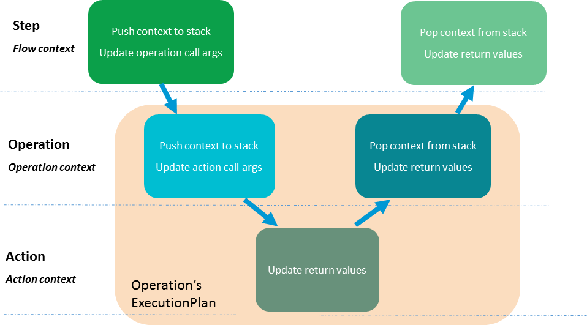
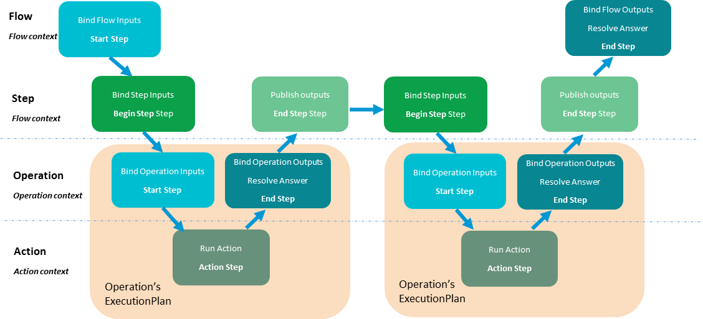
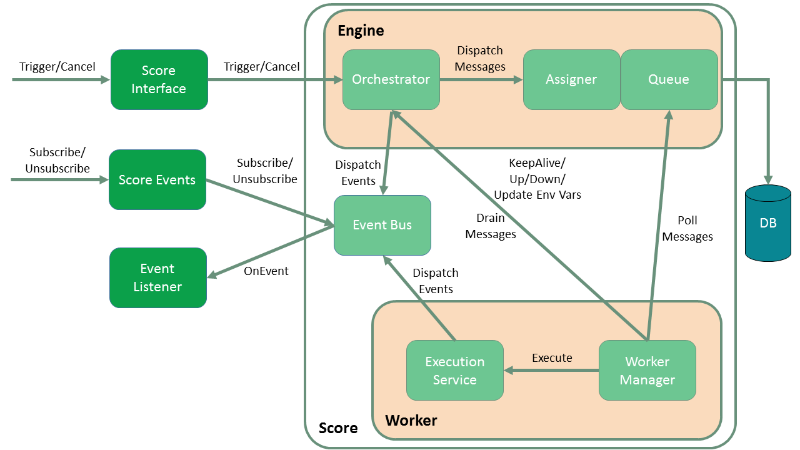

Architecture
++++++++++++

Overview
========

To be run by the CloudSlang Orchestration Engine (Score), a CloudSlang
source file must undergo a process to transform it into a Score
:ref:`ExecutionPlan <execution_plan>` using then ``SlangCompiler``.

Precompilation
--------------

The file is first loaded, along with its dependencies if necessary, and
parsed in the precompilation process. In precompilation, the CloudSlang
file's YAML structure is translated into Java maps by the ``YamlParser``
using `snakeyaml <http://snakeyaml.org>`__. That parsed structure is
then modeled to Java objects representing the parts of a flow and
operation by the ``SlangModeller`` and the ``ExecutableBuilder``. The
result of this process is an object of type ``Executable``.

Compilation
-----------

The resulting ``Executable`` object, along with its dependent
``Executable`` objects, are then passed to the ``ScoreCompiler`` for
compilation. An :ref:`ExecutionPlan <execution_plan>`
is created from the ``Executable`` using the ``ExecutionPlanBuilder``.
The ``ExecutionPlanBuilder`` uses the ``ExecutionStepFactory`` to
manufacture the appropriate Score :ref:`ExecutionStep <execution_step>` objects and add
them to the resulting :ref:`ExecutionPlan <execution_plan>`, which is then
packaged with its dependent :ref:`ExecutionPlan <execution_plan>` objects into a
``CompilationArtifact``.

Running
-------

Now that the CloudSlang source has been fully transformed into an
:ref:`ExecutionPlan <execution_plan>` it can be run using Score. The
:ref:`ExecutionPlan <execution_plan>` and its
dependencies are extracted from the ``CompilationArtifact`` and used to
create a :ref:`TriggeringProperties <triggering_properties>`
object. A `RunEnvironment <#runenvironment>`__ is also created and
added to the :ref:`TriggeringProperties <triggering_properties>`
context. The `RunEnvironment <#runenvironment>`__ provides services
to the :ref:`ExecutionPlan <execution_plan>` as it
runs, such as keeping track of the context stack and next step position.

Treatment of Flows and Operations
=================================

Generally, CloudSlang treats flows and operations similarly.

Flows and operations both:

-  Receive inputs, produce outputs, and have navigation logic.
-  Can be called by a flow's task.
-  Are compiled to ``ExecutionPlan``\ s that can be run by Score.

Scoped Contexts
===============

As execution progresses from flow to operation to action, the step data
(inputs, outputs, etc.) that is in scope changes. These contexts are
stored in the ``contextStack`` of the
`RunEnvironment <#runenvironment>`__ and get pushed onto and popped
off as the scope changes.

There are three types of scoped contexts:

-  Flow context
-  Operation context
-  Action context

Types of ExecutionSteps
=======================

As flows and operations are compiled, they are broken down into a number
of :ref:`ExecutionSteps <execution_step>`. These
steps are built using their corresponding methods in the
``ExecutionStepFactory``.

There are five types of :ref:`ExecutionSteps <execution_step>` used to build
a CloudSlang :ref:`ExecutionPlan <execution_plan>`:

-  Start Step
-  End Step
-  Begin Task Step
-  End Task Step
-  Action Step

An operation's :ref:`ExecutionPlan <execution_plan>`
is built from a Start Step, an Action Step and an End Step.

A flow's :ref:`ExecutionPlan <execution_plan>` is
built from a Start Step, a series of Begin Task Steps and End Task
Steps, and an End Step. The task steps hand off the execution to other
:ref:`ExecutionPlan <execution_plan>` objects representing operations or subflows.

RunEnvironment
==============

The ``RunEnvironment`` provides services to the
:ref:`ExecutionPlan <execution_plan>` as it is
running. The different `types of execution steps <#types-of-executionsteps>`__ read from, write
to and update the environment.

The ``RuntimeEnvironment`` contains:

-  **callArguments** - call arguments of the current step
-  **returnValues** - return values for the current step
-  **nextStepPosition** - position of the next step
-  **contextStack** - stack of contexts of the parent scopes
-  **parentFlowStack** - stack of the parent flows' data
-  **executionPath** - path of the current execution
-  **systemProperties** - system properties
-  **serializableDataMap** - serializable data that is common to the
   entire run

Engine Architecture
===================

The CloudSlang Orchestration Engine (Score) is built from two main
components, an engine and a worker. Scaling is achieved by adding
additional workers and/or engines.

   Score Architecture

Engine
------

The engine is responsible for managing the workers and interacting with
the database. It does not hold any state information itself.

The engine is composed of the following components:

-  **Orchestrator:** Responsible for creating new executions, canceling
   existing executions, providing the status of existing executions and
   managing the split/join mechanism.
-  **Assigner:** Responsible for assigning workers to executions.
-  **Queue:** Responsible for storing execution information in the
   database and responding with messages to polling workers.

Worker
------

The worker is responsible for doing the actual work of running the
execution plans. The worker holds the state of an execution as it is
running.

The worker is composed of the following components:

-  **Worker Manager:** Responsible for retrieving messages from the
   queue and placing them in the in-buffer, delegating messages to the
   execution service, draining messages from the out-buffer to the
   orchestrator and updating the engine as to the worker's status.
-  **Execution Service:** Responsible for executing the execution steps,
   pausing and canceling executions, splitting executions and
   dispatching relevant events.

Database
--------

The database is composed of the following tables categorized here by
their main functions:

-  Execution tracking:

   -  **RUNNING\_EXECUTION\_PLANS:** full data of an execution plan and
      all of its dependencies
   -  **EXECUTION\_STATE:** run statuses of an execution
   -  **EXECUTION\_QUEUE\_1:** metadata of execution message
   -  **EXECUTION\_STATES\_1 and EXECUTION\_STATES\_2:** full payloads
      of execution messages

-  Splitting and joining executions:

   -  **SUSPENDED\_EXECUTIONS:** executions that have been split
   -  **FINISHED\_BRANCHES:** finished branches of a split execution

-  Worker information:

   -  **WORKER\_NODES:** info of individual workers
   -  **WORKER\_GROUPS:** info of worker groups

-  Recovery:

   -  **WORKER\_LOCKS:** row to lock on during recovery process
   -  **VERSION\_COUNTERS:** version numbers for testing responsiveness

Typical Execution Path
----------------------

In a typical execution the **orchestrator** receives an
:ref:`ExecutionPlan <execution_plan>` along with all
that is needed to run it in a
:ref:`TriggeringProperties <triggering_properties>`
object through a call to the :ref:`Score interface's <score_interface>` ``trigger`` method.
The **orchestrator** inserts the full
:ref:`ExecutionPlan <execution_plan>` with all of its
dependencies into the ``RUNNING_EXECUTION_PLANS`` table. An
``Execution`` object is then created based on the
:ref:`TriggeringProperties <triggering_properties>`
and an ``EXECUTION_STATE`` record is inserted indicating that the
execution is running. The ``Execution`` object is then wrapped into an
``ExecutionMessage``. The **assigner** assigns the ``ExecutionMessage``
to a **worker** and places the message metadata into the
``EXECUTION_QUEUE_1`` table and its ``Payload`` into the active
``EXECUTION_STATES`` table.

The **worker manager** constantly polls the **queue** to see if there
are any ``ExecutionMessage``\ s that have been assigned to it. As
``ExecutionMessage``\ s are found, the **worker** acknowledges that they
were received, wraps them as ``SimpleExecutionRunnable``\ s and submits
them to the **execution service**. When a thread is available from the
**execution service**'s pool the execution will run one step (control
action and navigation action) at a time until there is a reason for it
to stop. There are various reasons for a execution to stop running on
the **worker** and return to the **engine** including: the execution is
finished, is about to split or it is taking too long. Once an execution
is stopped it is placed on the out-buffer which is periodically drained
back to the **engine**.

If the execution is finished, the **engine** fires a
``SCORE_FINISHED_EVENT`` and removes the execution's information from
all of the execution tables in the database.

Splitting and Joining Executions
--------------------------------

Before running each step, a worker checks to see if the step to be run
is a split step. If it is a split step, the worker creates a list of the
split executions. It puts the execution along with all its split
executions into a ``SplitMessage`` which is placed on the out-buffer.
After draining, the orchestrator's split-join service takes care of the
executions until they are to be rejoined. The service places the parent
execution into the ``SUSPENDED_EXECUTIONS`` table with a count of how
many branches it has been split into. ``Execution``\ s are created for
the split branches and placed on the queue. From there, they are picked
up as usual by workers and when they are finished they are added to the
``FINISHED_BRANCHES`` table. Periodically, a job runs to see if the
number of branches that have finished are equal to the number of
branches the original execution was split into. Once all the branches
are finished the original execution can be placed back onto the queue to
be picked up again by a worker.

Recovery
--------

The recovery mechanism allows Score to recover from situations that
would cause a loss of data otherwise. The recovery mechanism guarantees
that each step of an execution plan will be run, but does not guarantee
that it will be run only once. The most common recovery situations are
outlined below.

Lost Worker
~~~~~~~~~~~

To prevent the loss of data from a worker that is no longer responsive
the recovery mechanism does the following. Each worker continually
reports their active status to the engine which stores a reporting
version number for the worker in the ``WORKER_NODES`` table.
Periodically a recovery job runs and sees which workers' reported
version numbers are outdated, indicating that they have not been
reporting back. The non-responsive workers' records in the queue get
reassigned to other workers that pick up from the last known step that
was executed.

Worker Restart
~~~~~~~~~~~~~~

To prevent the loss of data from a worker that has been restarted
additional measures must be taken. The restarted worker will report that
it is active, so the recovery job will not know to reassign the
executions that were lost when it was restarted. Therefore, every time a
worker has been started an internal recovery is done. The worker's
buffers are cleaned and the worker reports to the engine that it is
starting up. The engine then checks the queue to see if that worker has
anything that's already on the queue. Whatever is found is passed on to
a different worker while the restarted one finishes starting up before
polling for new messages.
