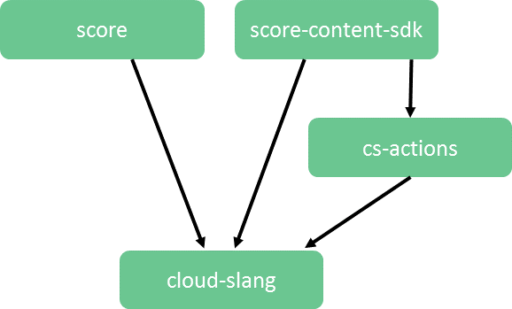

Contributions
+++++++++++++

GitHub Repositories
===================

The CloudSlang project consists of the following
`repositories <https://github.com/cloudslang>`__ on GitHub with the
dependencies depicted in the diagram below.

**Dependency diagram**

-  **score** - CloudSlang Orchestration Engine (Score)

   -  engine
   -  package
   -  score-api
   -  score-samples
   -  score-tests
   -  worker

-  **cloud-slang** - CloudSlang and the CLI

   -  score-lang-api
   -  score-lang-cli
   -  score-lang-compiler
   -  score-lang-entities
   -  score-lang-runtime
   -  score-language-tests

-  **cloud-slang-content** - CloudSlang flows and operations

   -  io/cloudslang

      -  base

         -  cmd
         -  comparisons
         -  files
         -  json
         -  lists
         -  mail
         -  math
         -  network
         -  os

            -  linux

         -  print
         -  remote\_command\_execution

            -  remote\_file\_transfer
            -  ssh

         -  strings
         -  utils

      -  chef
      -  cloud\_provider

         -  amazon\_aws
         -  digital\_ocean
         -  hp\_cloud

      -  consul
      -  coreos
      -  docker
      -  git
      -  jenkins
      -  marathon
      -  openstack
      -  paas

         -  openstack
         -  stackato

      -  (other integrations to be added as new folders)

-  **score-actions** - Java @Action classes used by CloudSlang

   -  score-data-format
   -  score-http-client
   -  score-jClouds
   -  score-mail
   -  score-rft
   -  score-ssh
   -  score-utilities

-  **score-content-sdk** - SDK for developing Java @Actions

   -  src/main/java/com/hp/oo/sdk/content

      -  annotations
      -  plugin

         -  ActionMetadata

-  **test-functional** - Global functional tests for CLI and builder
-  **CloudSlang-Docker-Image** - CloudSlang Docker image
-  **CloudSlang.github.io** - CloudSlang website
-  **docs** - CloudSlang documentation
-  **atom-cloudslang-package** - Atom package for CloudSlang support

Contribution Guide
==================

We welcome and encourage community contributions to CloudSlang. Please
familiarize yourself with the Contribution Guidelines and `Project Roadmap
<https://github.com/CloudSlang/cloud-slang/wiki/Project-Roadmap>`__ before
contributing.

There are many ways to help the CloudSlang project:

-  Report issues
-  Fix issues
-  Improve the documentation

Contributing Code
-----------------

The best way to directly collaborate with the project contributors is
through GitHub: https://github.com/CloudSlang.

-  If you want to contribute to our code by either fixing a problem or
   creating a new feature, please open a GitHub pull request.
-  If you want to raise an issue such as a defect, an enhancement
   request or a general issue, please open a GitHub issue.

**Note:** All patches from all contributors get reviewed.

After a pull request is made, other contributors will offer feedback. If
the patch passes review, a maintainer will accept it with a comment.

When a pull request fails testing, the author is expected to update the
pull request to address the failure until it passes testing and the pull
request merges successfully.

At least one review from a maintainer is required for all patches (even
patches from maintainers).

Content contributions which require environments that are difficult to setup
may be accepted as beta content. Beta content is not verified or tested by the
CloudSlang team. Beta content is named with the ``beta_`` prefix. The community
is encouraged to assist in setting up testing environments for the beta content.

See the contributing.md file in the relevant repository for additional
guidelines specific to that repository.

Developer's Certificate of Origin
---------------------------------

All contributions must include acceptance of the DCO:

Developer Certificate of Origin Version 1.1

Copyright (C) 2004, 2006 The Linux Foundation and its contributors. 660
York Street, Suite 102, San Francisco, CA 94110 USA

Everyone is permitted to copy and distribute verbatim copies of this
license document, but changing it is not allowed.

Developer's Certificate of Origin 1.1

By making a contribution to this project, I certify that:

(a) The contribution was created in whole or in part by me and I have
    the right to submit it under the open source license indicated in
    the file; or

(b) The contribution is based upon previous work that, to the best of my
    knowledge, is covered under an appropriate open source license and I
    have the right under that license to submit that work with
    modifications, whether created in whole or in part by me, under the
    same open source license (unless I am permitted to submit under a
    different license), as indicated in the file; or

(c) The contribution was provided directly to me by some other person
    who certified (a), (b) or (c) and I have not modified it.

(d) I understand and agree that this project and the contribution are
    public and that a record of the contribution (including all personal
    information I submit with it, including my sign-off) is maintained
    indefinitely and may be redistributed consistent with this project
    or the open source license(s) involved.

Sign your work
~~~~~~~~~~~~~~

To accept the DCO, simply add this line to each commit message with your
name and email address (``git commit -s`` will do this for you):

``Signed-off-by: Jane Example <jane@example.com>``

For legal reasons, no anonymous or pseudonymous contributions are
accepted.

Pull Requests
~~~~~~~~~~~~~

We encourage and support contributions from the community. No fix is too
small. We strive to process all pull requests as soon as possible and
with constructive feedback. If your pull request is not accepted at
first, please try again after addressing the feedback you received.

To make a pull request you will need a GitHub account. For help, see
GitHub's `documentation on forking and pull
requests <https://help.github.com/articles/using-pull-requests/>`__.

Normally, all pull requests must include tests that validate your
change. Occasionally, a change will be very difficult to test. In those
cases, please include a note in your commit message explaining why tests
are not included.

Conduct
~~~~~~~

Whether you are a regular contributor or a newcomer, we care about
making this community a safe place for you.

We are committed to providing a friendly, safe and welcoming environment
for all regardless of their background and the extent of their
contributions.

Please avoid using nicknames that might detract from a friendly, safe
and welcoming environment for all. Be kind and courteous.

Those who insult, demean or harass anyone will be excluded from
interaction. In particular, behavior that excludes people in socially
marginalized groups will not be tolerated.

We welcome discussion about creating a welcoming, safe and productive
environment for the community. If you have any questions, feedback or
concerns please let us know. (info@cloudslang.io)
