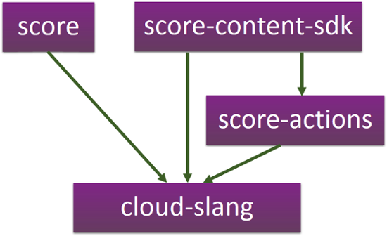

#GitHub Repositories
The CloudSlang project consists of the following [repositories](https://github.com/cloudslang) on GitHub with the dependencies depicted in the diagram below.

**Dependency diagram**

+ **score** - CloudSlang Orchestration Engine (Score)
    + engine
    + package
    + score-api
    + score-samples
    + score-tests
    + worker 
+ **cloud-slang** - CloudSlang and the CLI
    + score-lang-api
    + score-lang-cli
    + score-lang-compiler
    + score-lang-entities
    + score-lang-runtime
    + score-language-tests 
+ **cloud-slang-content** - CloudSlang flows and operations
    + io/cloudslang
        + base
            + comparisons
            + files
            + lists
            + mail
            + network
            + os
                + linux 
            + remote_command_execution
                + ssh
            + print
            + strings
            + utils  
        + consul
        + coreos 
        + docker
        + jenkins
        + marathon
        + openstack
        + (other integrations to be added as new folders)  
+ **score-actions** - Java @Action classes used by CloudSlang
    + score-http-client
    + score-mail
    + score-ssh
    + score-utilities 
+ **score-content-sdk** - SDK for developing Java @Actions
    + src/main/java/com/hp/oo/sdk/content
        + annotations
        + plugin
            + ActionMetadata   
+ **CloudSlang-Docker-Image** - CloudSlang Docker image
+ **CloudSlang.github.io** - CloudSlang website
+ **docs** - CloudSlang documentation

# Contribution Guide

We welcome and encourage community contributions to CloudSlang.
Please familiarize yourself with the Contribution Guidelines and Project Roadmap before contributing.

There are many ways to help the CloudSlang project:

* Report issues
* Fix issues
* Improve the documentation

## Contributing Code

The best way to directly collaborate with the project contributors is through GitHub: https://github.com/CloudSlang.

* If you want to contribute to our code by either fixing a problem or creating a new feature, please open a GitHub pull request.
* If you want to raise an issue such as a defect, an enhancement request or a general issue, please open a GitHub issue.

Note that all patches from all contributors get reviewed.

After a pull request is made, other contributors will offer feedback. If the patch passes review, a maintainer will accept it with a comment.

When a pull request fails testing, the author is expected to update the pull request to address the failure until it passes testing and the pull request merges successfully.

At least one review from a maintainer is required for all patches (even patches from maintainers).

See the contributing.md file in the relevant repository for additional guidelines specific to that repository.  

## Developer's Certificate of Origin

All contributions must include acceptance of the DCO:

Developer Certificate of Origin
Version 1.1

Copyright (C) 2004, 2006 The Linux Foundation and its contributors.
660 York Street, Suite 102,
San Francisco, CA 94110 USA

Everyone is permitted to copy and distribute verbatim copies of this license document, but changing it is not allowed.

Developer's Certificate of Origin 1.1

By making a contribution to this project, I certify that:

(a) The contribution was created in whole or in part by me and I have the right to submit it under the open source license indicated in the file; or

(b) The contribution is based upon previous work that, to the best of my knowledge, is covered under an appropriate open source license and I have the right under that license to submit that work with modifications, whether created in whole or in part by me, under the same open source license (unless I am permitted to submit under a different license), as indicated in the file; or

(c) The contribution was provided directly to me by some other person who certified (a), (b) or (c) and I have not modified it.

(d) I understand and agree that this project and the contribution are public and that a record of the contribution (including all personal information I submit with it, including my sign-off) is maintained indefinitely and may be redistributed consistent with this project or the open source license(s) involved.

### Sign your work

To accept the DCO, simply add this line to each commit message with your name and email address (`git commit -s` will do this for you):

`Signed-off-by: Jane Example <jane@example.com>`

For legal reasons, no anonymous or pseudonymous contributions are accepted.

### Pull Requests
We encourage and support contributions from the community. No fix is too small. We strive to process all pull requests as soon as possible and with constructive feedback. If your pull request is not accepted at first, please try again after addressing the feedback you received.

To make a pull request you will need a GitHub account. For help, see GitHub's [documentation on forking and pull requests](https://help.github.com/articles/using-pull-requests/ ).

Normally, all pull requests must include tests that validate your change. Occasionally, a change will be very difficult to test. In those cases, please include a note in your commit message explaining why tests are not included.

###Conduct

Whether you are a regular contributor or a newcomer, we care about making this community a safe place for you.

We are committed to providing a friendly, safe and welcoming environment for all regardless of their background and the extent of their contributions.

Please avoid using nicknames that might detract from a friendly, safe and welcoming environment for all. Be kind and courteous.

Those who insult, demean or harass anyone will be excluded from interaction. In particular, behavior that excludes people in socially marginalized groups will not be tolerated.

We welcome discussion about creating a welcoming, safe and productive environment for the community. If you have any questions, feedback or concerns please let us know. (info@cloudslang.io)
