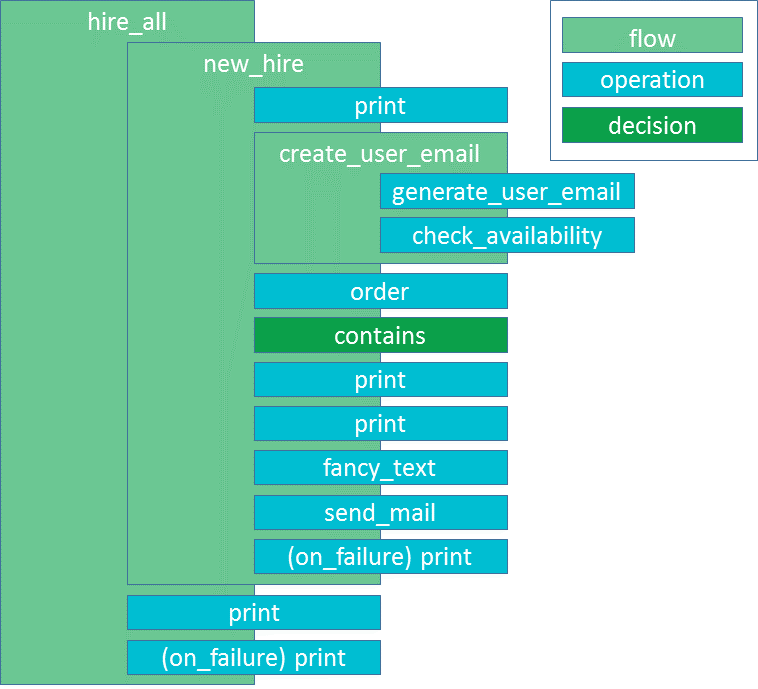

Lesson 1 - Introduction and Setup
=================================

Goal
----

In this lesson we'll outline our overall goals for this tutorial and set
up an environment to write and run flows.

Overview
--------

In this tutorial we will build a flow that represents the process a new
hire must go through to get set up to work. We will build the flow one
piece at a time with the goal of highlighting the features of
CloudSlang. We recommend you follow along with the process, writing the
flows and operations we will build on your own machine and running them
using the :doc:`CloudSlang CLI <../cloudslang_cli>`. To do so, you'll
need a text editor to create the CloudSlang files and the CloudSlang CLI
to run them.

YAML
----

CloudSlang is a YAML-based language so it's important to know a bit
about YAML before getting started. If you're new to YAML, you can take a
look at the :doc:`YAML Overview <../yaml_overview>` section of the
CloudSlang documentation to familiarize yourself with its main
structure. This tutorial will also include **YAML Notes** to guide you
through potential trouble areas.

Copy/Pasting Code
-----------------

Because proper indentation is so important in YAML, take care to indent pasted
code examples to their proper indentation levels.

Prerequisites
-------------

This tutorial uses the CloudSlang CLI to run flows. See the :doc:`CloudSlang
CLI <../cloudslang_cli>` section of the documentation for
instructions on how to download and run the CLI.

Although CloudSlang files can be composed in any text editor, using a
modern code editor with support for syntax highlighting is
recommended. See :doc:`CloudSlang Editors <../cloudslang_editors>` for
instructions on how to download, install and use the CloudSlang language
package for Atom.

More Information
----------------

For more information on any of the topics covered in this tutorial, see
the :doc:`CloudSlang documentation <../index>`.

Flows and Operations
--------------------

Let's begin our study of the CloudSlang language by discussing the two types of
CloudSlang executable contructs, flows and operations.

Generally, CloudSlang treats flows and operations similarly. Flows and
operations can both receive inputs, produce outputs, return results and can be
called by a flow’s task.

But flows and operations serve different purposes. An operation contains an
action, which can be written in Python or Java. Operations perform the “work”
part of the workflow. A flow contains tasks, which stitch together the actions
performed by operations (or subflows), navigating and passing data from one
to the other based on operation results and outputs. Flows perform the “flow”
part of the workflow.

Here is a diagram of the flow and operation structure we will be building in
this tutorial.

Setup
-----

We'll write our first operation and flow in the next couple of lessons. But
before we do that we'll setup our folder structure to get ready.

Create a folder named **tutorials**. We'll store our flows and
operations in this folder. Since we're going to have some general
content as well as content that is specific to our use case, let's
create two subfolders under **tutorials** called **base** and
**hiring**.

We'll start off with just one flow and one operation. In the next two lessons
we'll create a file named **new_hire.sl** in the **hiring** folder and in the
**base** folder we'll create a file named **print.sl**. The file **new_hire.sl**
will hold our flow and **print.sl** will hold our first operation.

Your file structure will look like this:

-  tutorials

   -  base

      -  print.sl

   -  hiring

      -  new_hire.sl

**Note:** If your editor requires it for syntax highlighting, you can
also use the **.sl.yaml** and **.sl.yml** extensions.

Up Next
-------

In the next lesson we'll write and run our first operation.
